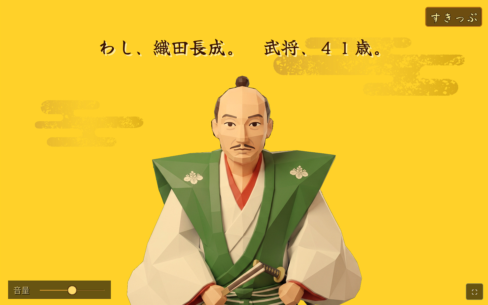
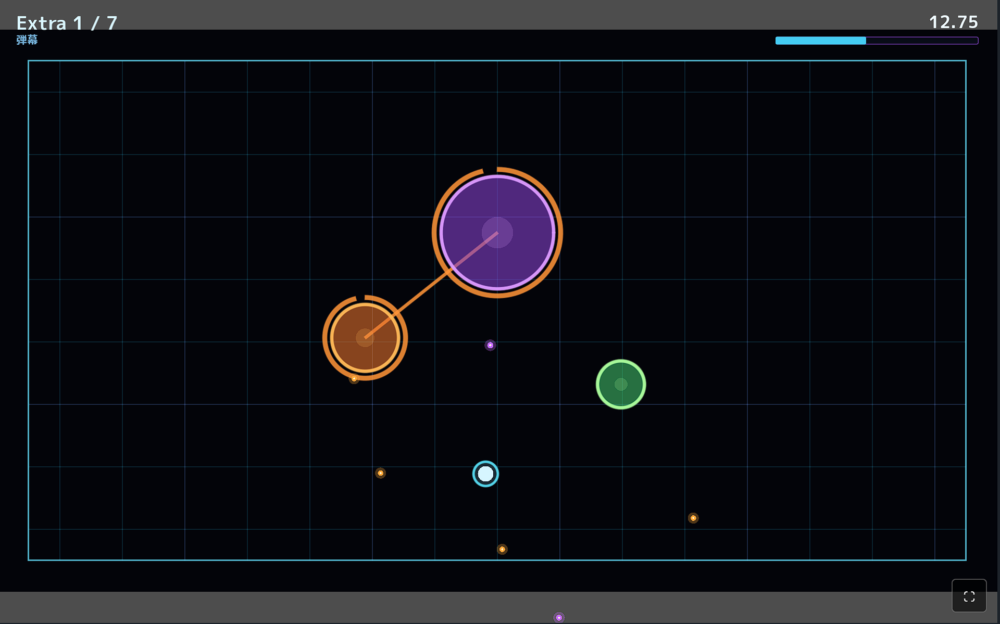
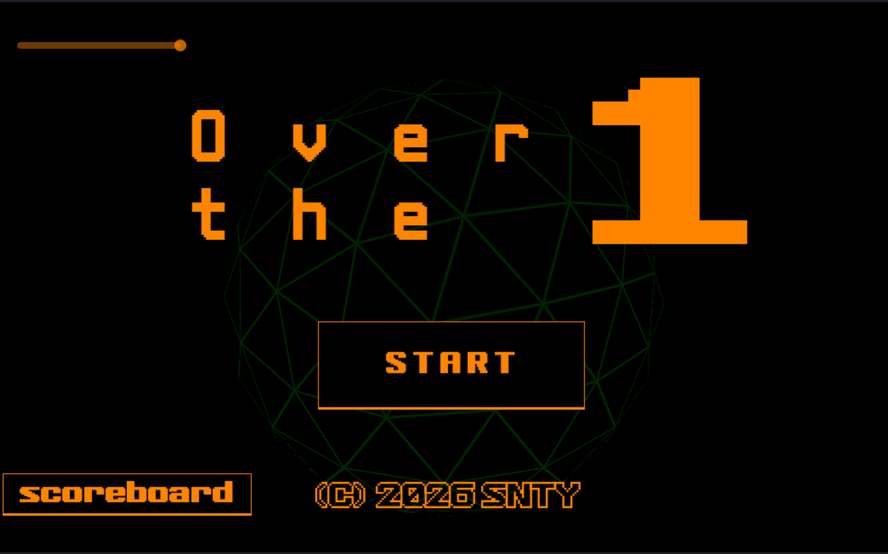

Illustration by [GINJA Project](https://github.com/SirakabaBiome/G_in_JA)

---

# 結果発表！

みなさま、ご参加ありがとうございました。  
45作品の投稿が寄せられ、審査員の皆様からご評価いただき、以下のような結果が決まりました。

## 優秀賞：本丸まもろう織田長成

作者：[PRESO様](https://x.com/pureso_studio)

[Godot Player:本丸まもろう織田長成](https://godotplayer.com/games/pureso_honmaru)

#### 評価コメント：

- クオリティが高く、ゲームスタートから一貫してテンポがよい
- 本格お手軽シミュレーション。スキルツリーの選択によって大きく変わるのが楽しい。これは夢中になってやりこんでしまった！
- 雰囲気よしのタワーディフェンス。スキルツリーをリアルタイムに成長させていくのが面白かった


本”丸”とスキルツリーの成長でテーマにマッチさせたんですね！
キャラクターがどこかマヌケなかわいさがあってよかったです。
―― Saitos


## 佳作：Growing Circles

作者：[万事屋ショウマ様](https://x.com/yorozuya_shoma)

[Godot Player: Glowing Circles](https://godotplayer.com/games/growing_circles)

#### 評価コメント
- 敵側の丸が成長するのが斬新で面白かった。アクションゲームの難易度が高めでやりごたえあり！
- 円同士の合体を防ぐために近づくリスクリターンのおもしろさがある。
- 敵の間を切るのがすき。EXTRAまで夢中で全クリしました。

## 佳作：

作者：[Sanity Games様](https://x.com/sayamapp)

[Godot Player:Over the 1](https://godotplayer.com/games/over_the_one)

#### 評価コメント
- 雰囲気と操作のクオリティ高い。グレイズ楽しい。
- スネークゲーと呼ばれるジャンルで、かなり面白かった。自機もせっかくなら丸で合ってほしかった気持ち。
- シンプルに球体での操作が楽しい。

---

以下、開催概要をログとして残します。

# 開催概要

`Godot Japan Game Jam`は年に一度開催するGodot Japanコミュニティのゲームジャムです。  
**2つのテーマを組み合わせたお題**で5日間の期間で[Godot Player](https://godotplayer.com/)にて投稿いただきます。


**開催日時**
2026年5月1日 0:00 ～ 5月5日 23:59
**参加登録期間**
2026年4月14日～4月30日


※参加には賞品のためメールアドレスと、投稿のための[Godot Player](https://godotplayer.com/)アカウントの登録が必要です。

---

## 選考について

2026年開催におきましては**Godot Japanコミュニティの運営メンバー**が選考し優秀賞を決定します。  
（今後ユーザー同士の評価を取り入れられるようにしたいと考えています）

---

## 優秀賞・佳作賞品

- 優秀賞（1作品）：Amazonギフトカード **10,000円分**
- 佳作（2作品）：Amazonギフトカード **5,000円分**

---

# ガイドライン・ルール

- 本ゲームジャムは[Godot Playerの利用規約](https://godotplayer.com/terms)および[Godot Community Code of Conduct](https://godotengine.org/code-of-conduct/)に準じます。
- AIの利用は任意ですが、他者の権利を侵害するアセットなどの利用は禁止します。
- また、それによって発生する責任はGodot Japanコミュニティおよびその運営チーム・スタッフは一切負いません。
- 複数名によるチームでの参加は可能ですが、参加登録は代表者が登録するようにお願いします。
- 参加者あたり複数のゲームの投稿も可能ですが、荒らしを目的とした投稿と判断されるものは本ゲームジャムへの参加自体を却下します。