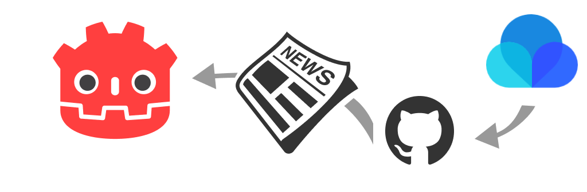

Godotユーザーのみなさん、こんにちは。
2023年1月12日（木）15時頃から毎週更新される **Weekly Godot Japan** の記事配信が開始されます。

配信日が木曜日なのは *「日本でのパッケージゲームの発売日」* が基本的に木曜日だからです😋

約1年前に更新を止めてしまった[This Week in Godot](https://thisweekingodot.com/)からインスパイアされて作成されたニュース配信です。
リンク自体はユーザーの手で厳選されブックマークに追加されるため厳密には「自動」ではなく「半自動」ですが、記事の作成から配信はすべて自動化されています。

この自動配信は[Raindrop.io](https://raindrop.io/)による強力なAPIによって実現しています。
PCブラウザの拡張機能で簡単にリンクを追加できるだけでなく、スマートフォンアプリで手軽にリンクを追加することができます。
とてもおすすめのサービスですので、ぜひ利用してみてください。

さて、本題の**Weekly Godot Japan**ですが、[Raindrop.io](https://raindrop.io/)にはコラボレーター機能があるので、複数人でブックマークを作っていくことができます。
つまり**Weekly Godot Japan**も本サイトと同じく、**どなたでも参加ができるコミュニティ記事**として機能しています。

ただし、あまりに簡単にリンクすることができるため、セキュリティ上の理由からメンバーは管理者による許可制になっていることをご理解ください。

もし、ブックマークのコラボレーションをご希望の方は、[Discordサーバー](https://discord.gg/DyFvSJZ)で`@Saitos`宛にメンションしてください。
もちろん、リンクだけの共有も歓迎しています。

それでは、明日からのWeekly Godot Japanをお楽しみください。
良いGodotライフをお過ごしください🥳