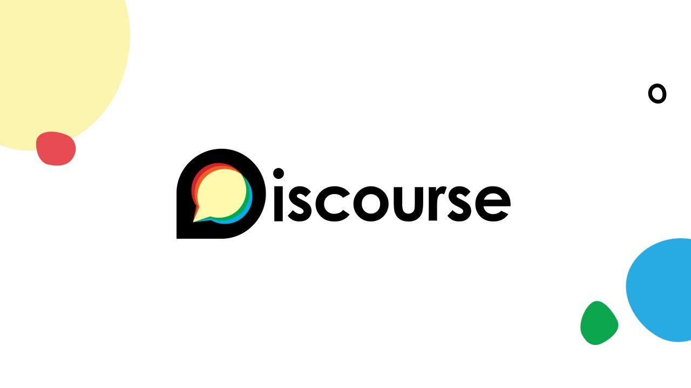

この度、Godot Japanが大幅リニューアルしました。

サイト立ち上げから約1年半ですが、あまり大きな活動ができませんでした。
しかし、2023年～2024年で**Godot Meetup Tokyo**を開催することができ、多くのユーザー・企業様のご協力を経てコミュニティは国内最大級に成長しました。
今回のリニューアルの内容をご紹介します。

---

### Godot Japan User CommunityからGodot Japanに変更

[Godot Engineサイトに掲載されているユーザーグループ](https://godotengine.org/community/user-groups/)にはGodot Japanと掲載されているのに、名称不一致が起きていることも理由の一つです。

様々なサービスを展開するにあたってGodot Japanとしておいたほうが都合が良いためです。

以下でご紹介するドメイン取得やフォーラム開設にあたっても、今後検討する別のサービスにおいても「Godot Japan〇〇」とできる点から、名称変更いたしました。

### 独自ドメインの取得

名称変更に合わせてドメインを取得しました。
スポンサーの皆様のおかげでドメイン運用費・サーバー運用費に充てることができるようになりました（ありがとうございます）

`.com`ドメインは商用（commercial）を意味していますが、コミュニティ（community）の意味合いで取得しています。
一般的に商用を意味しますが、引き続きGodot Japanは非営利として活動を続けていきます。

### 日本語版Webフォーラムの開設

[Godot Japanフォーラムへ](https://forum.godot-japan.com/)

Discordサーバーは基本的にクローズドであり、公な情報交換がされてきませんでした。
今回インターネット上に情報を残す意味で、専用サーバーを用意し、日本語フォーラムを開設しました。

Godot公式フォーラムやUnreal Engine、Figma、OpenAIなども利用している、DiscourseをGodot Japan専用のフォーラムとして構築しています。

投稿するためにはユーザー登録が必要となりますが、閲覧はどなたでも可能です。
登録方法もDiscord認証が可能ですので、Discordコミュニティと合わせてご活用ください。

#### Discordフォーラムとの使い分けについて

Discordコミュニティでもフォーラムが存在しています。
こちらも引き続きご利用いただけます。

**なるべくWeb上での情報を制限したい場合など**は、クローズドコミュニティでのフォーラム活用が向いています。
（ただし情報の秘匿性に対する責任はGodot Japanでは負いかねますので、あらかじめご了承ください）

### 逆引きリファレンスの整理

Hugoのテーマ的に、結構無理な作りになっていたので、整理しました。
ニュースなどと同様にセクション毎で見れるようにしましたので、単体のUX的にはひと手間増えてしまう更新です。
しかし[Godot Japanフォーラム](https://forum.godot-japan.com/)同様、大きな階層から深堀して閲覧いただけるようになりました。

また[Giscus](https://giscus.app/)を導入しましたので、各記事に対してコメントやリアクションをつけられるようになりました。
Githubへのログインがされていれば、記事の内容に関する指摘や質問・意見を受けられます。

基本的に更新方法は変更していませんので、引き続き皆様からの寄稿をお待ちしています。

### その他

そのほかの細かなアップデートをお知らせします。

#### お問い合わせフォームの開設

これまでお問い合わせはDiscordかGithubに頼っていました。
プレスリリースや技術的・組織的なお問い合わせ窓口が存在していませんでしたので、Godot Japan専用の窓口を開設しました。

#### プレスキットの追加

イベントを開催するにあたり、Godot Japanのリソースを必要とされました。
明確にリソースを定義していませんでしたので、改めて定義し、どなたでも利用することができるようになりました。

---

今後ともGodot Japanをよろしくお願いいたします。
