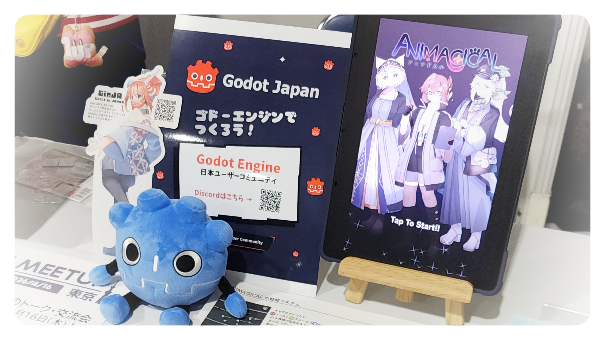
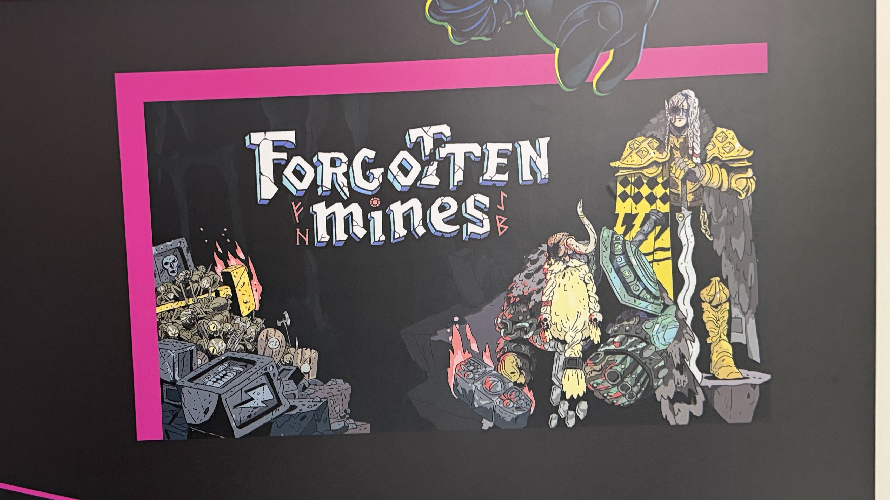
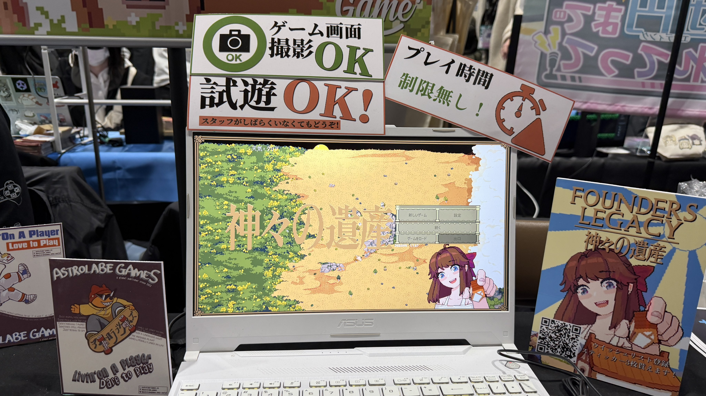
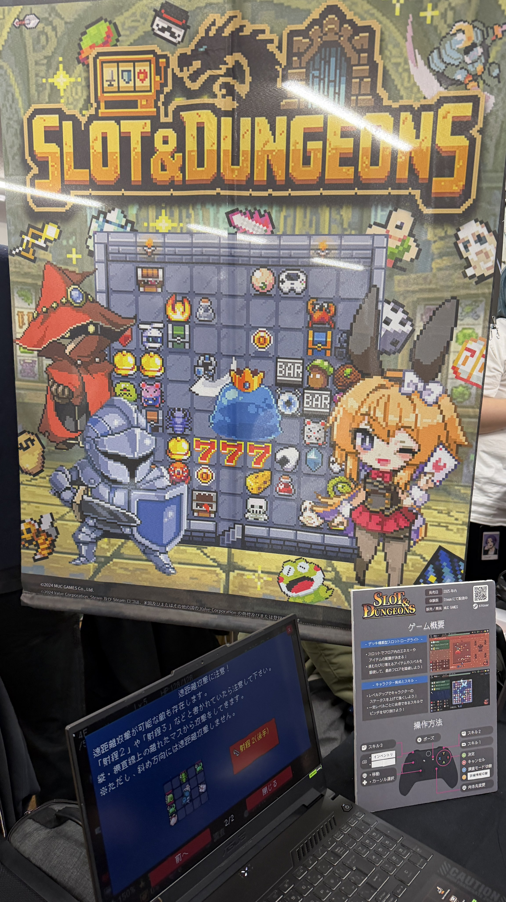
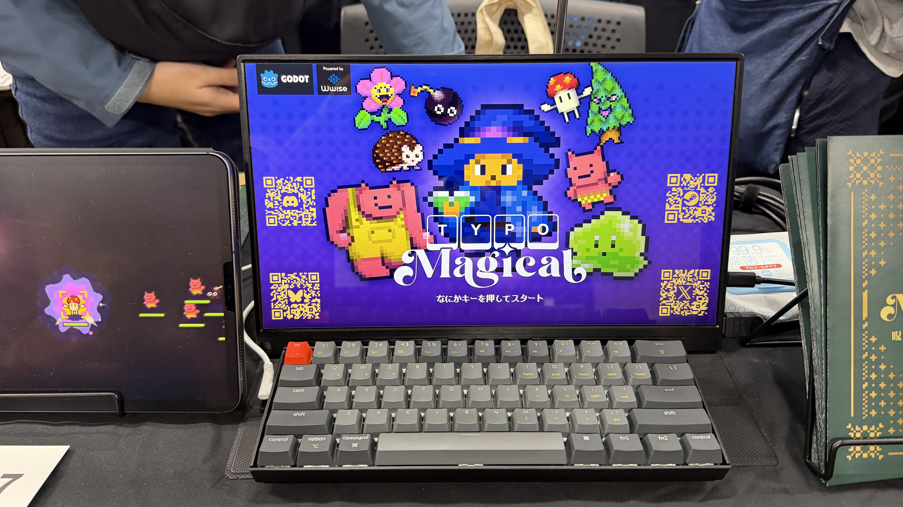
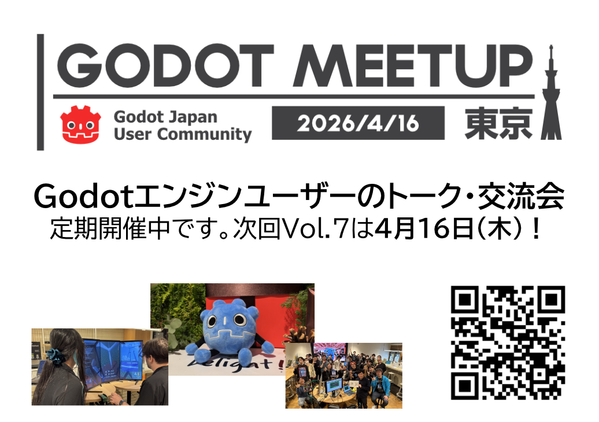
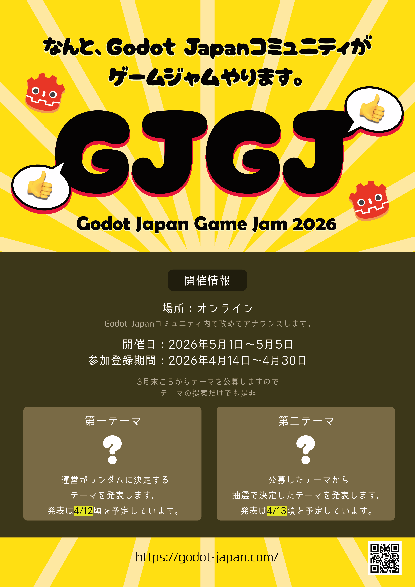

先日開催された[TOKYO INDIE GAMES SUMMIT 2026](https://indiegamessummit.tokyo/)（以下TIGS2026）にて、[株式会社フレームシンセシス](https://framesynthesis.co.jp/)さんのブースをお借りする形でGodot Japan User Communityのブースを出展してきました！

## GodotJapanブースにて

Godot JapanのDiscordの宣伝や次回Godot Meetup Tokyoの宣伝を行いました。
また、私白樺バイオームがGodotEngineで制作中のゲームANIMAGICALを、GodotEngine製のゲームのデモとして展示を行いました。

訪れた方の多くはGodotEngineを知らない方が多かったのですが、名前だけは知っている、バリバリ制作に使っている、という方もそれなりにいた印象です。

GodotEngineを名前だけ知っている方の多くはライセンス周りの自由度や、開発の始めやすさについて説明いたしました。
言語についての質問もかなり多かったのですが、[Slay the Spire 2](https://store.steampowered.com/app/2868840/Slay_the_Spire_2/)がGodot C#で制作されていることを説明すると驚かれていた印象です。
また、ドキュメントが読みやすいことはGodot Engineの大きな利点なのでその説明も行いました。

私が試遊展示用に持っていったのがAndroidタブレットなのですが、Androidタブレット内にGodotEngineと実際のプロジェクトを入れて持っていき、試しに触っていただくと好感を持たれた方も多い印象です。
また、個人的な話にはなるのですが、立ち絵を外部ライブラリ無しでGodotEngineの標準機能のみで動かしていると説明するとイラスト周りのクリエイターさんに興味を持っていただけました。

GodotEngineでバリバリ制作しているという方の多くはGodot Japan User Communityの存在を知らない方が多かったので、もう少し宣伝を頑張りたいなぁ……という気持ちです。
逆に言うとコミュニティに属さなくても開発できるわかりやすいエンジンなのかもしれません。

## TIGS2026で出展していたGodot製ゲーム

私はブースの展示に集中していたため実際には触っておらず、KorinVRさんからの情報がメインになります。ご了承ください。

### Forgotten Mines

[Steamページ](https://store.steampowered.com/app/2238630/Forgotten_Mines/)
[BlueSkyアカウント](https://bsky.app/profile/cannibalgoose.bsky.social)

### Founders Legacy 神々の遺産

[Steamページ](https://store.steampowered.com/app/3351230/Founders_Legacy/)
[パブリッシャーXアカウント](https://x.com/AstrolabeGameJP)

### Identifile: Desktop Dungeon

ブース写真なし

[Steamページ](https://store.steampowered.com/app/3054210/Identifile_Desktop_Dungeon/)
[Xアカウント](https://x.com/GearbyteGames)

### Slot & Dungeons

[Steamページ](https://store.steampowered.com/app/3160090/Slot__Dungeons/)
[Xアカウント](https://x.com/muc_games)

### Typomagical

[Steamページ](https://store.steampowered.com/app/3816290/Typomagical/)
[Xアカウント](https://x.com/sigcomstudio)

## お知らせ

### Godot Meetup Tokyo次回開催決定！

[Connpassページ](https://godot-jp.connpass.com/)

日時 2026/04/16 (木) 夜
場所 DeNA様イベントスペース

詳細は[Connpassページ](https://godot-jp.connpass.com/)をフォローし、お待ち下さい！

### GodotJapanGameJam開催決定！

詳細は[Discordサーバー](https://discord.gg/DyFvSJZ)に参加し、お待ち下さい！
