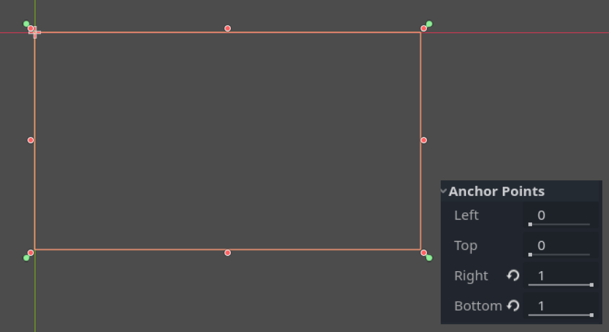
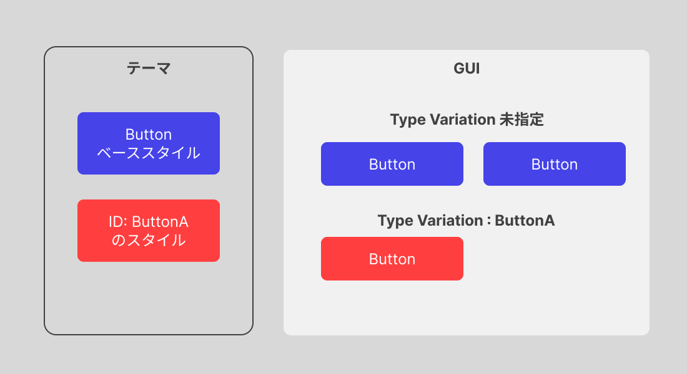

`Godot Engine`の`Control`ノードはGUI（グラフィカルユーザーインターフェース）を作成する機能になります。
もちろん、同じ`CanvasItem`を継承する`Node2D`でもGUIを作ることは可能ですが、**レスポンシブなレイアウト機能**や**自動的なフォーカス機能**などを持っているため、独自のプログラムを組まずとも`Godot Engine`のエディタで簡単にデザインができる事が特徴です。


また、翻訳を設定していると自動的にノードに含まれたテキストを翻訳したり、テーマを設定することができます。


# 概念

## 基点とアンカー

まず、アンカーとは、**画面または親のControlノードの基準となる位置**です。
アンカーには、上下左右の4点の設定があり、これらはあくまでも相対的な割合になります。

例えば、左上にアンカーがある場合は、画面（または親の`Control`ノード）の左上から`0`の相対的な位置を示します。
上記の例で言うと、`Left：0, Top：0`と共に`Right：0, Bottom：0`になっているのがわかります。


それぞれ、`0~1`の間で、画面または親の`Control`ノードの左上を基準とした位置の割合になります。
つまり、`Left:0, Top:0, Right:1, Bottom:1`は画面全体となります。



## アンカーの設定方法

`Godot Engine 4.0`からアンカーは自動的に設定しやすくなりました。


`Control`ノードを選択して、エディタビューポートの上部のメニューから、アンカーの設定をワンクリックで設定できるようになっています。
細かな調整をする場合は、前項までの設定を個別にする必要がありますが、多くの場合はプリセットで対応可能かと思います。


# 機能

## 翻訳


翻訳については別ページで詳しく説明しますが、この項目では`Control`ノードが持つ翻訳についての機能のみを取り上げます。


`Control`ノードを継承するノードすべてに**翻訳するかどうかのプロパティが設定されています（デフォルトは`auto_translate: true`）**
例えば、`Button`や`Label`などのテキストが表示されているノードの文字を翻訳するかどうかのプロパティになります。

翻訳データが無い場合は、デフォルトの言語が使われるため、基本的には意識しなくても問題ありません。
ただし翻訳データが存在している場合、ノードに使用されている文言を翻訳すると自動的に置き換わりますので、翻訳キーには注意が必要です。

## フォーカス

`Control`ノードは、<kbd>tab</kbd>キーや上下左右キー（対応するゲームパッドの方向キーなど）を押した際に自動的にフォーカスする機能を持っています。
例えば、複数のボタンを方向キーで選択することができます。

ただし、画面上のフォーカスができるすべてのノードを自動的に選んで選択するため、画面レイアウトによっては**明示的にフォーカス機能を一時的にオフにする** などの対応が必要になります。

```gdscript
var btn:Button = $Button

func _ready():
    # フォーカスを無効にする
    btn.focus_mode = Control.FOCUS_NONE
    # フォーカスを有効にする
    btn.focus_mode = Control.FOCUS_ALL
    # マウスクリックのみのフォーカスを受け付ける
    btn.focus_mode = Control.FOCUS_CLICK
```

## マウスクリック制限とスルー

`Control`ノードはレイアウトとして複数重なる事が多く起こります。
例えば、ボタンとウィンドウはどちらも`Control`ノードで重なっていることが多いですし、さらにそのウィンドウのうらには別のウィンドウが表示されている場合もあります。
こういった場合に、ボタンをクリックすると、後ろにあるボタンも反応してしまう または、あえて反応させたい というシチュエーションがあります。

これらの挙動もいくつかのプロパティが用意されています。

### クリックの深さ

`Control`ノードのインスペクタから`Mouse`セクションの`Filter`に設定があります。
`GDScript`では以下のようになります。

```gdscript
var btn:Button = $Button

func _ready():
    btn.mouse_filter = Control.MOUSE_FILTER_STOP 
    btn.mouse_filter = Control.MOUSE_FILTER_PASS 
    btn.mouse_filter = Control.MOUSE_FILTER_IGNORE 
```

|タイプ|説明|
|---|---|
|MOUSE_FILTER_STOP|クリックされた`Control`ノードでクリックの影響を止めます。|
|MOUSE_FILTER_PASS|クリックされた`Control`ノードよりも後ろにあるノードもクリックの影響を受けます。|
|MOUSE_FILTER_IGNORE|クリックされた`Control`ノードはクリックを無視します（影響は止まりません）|

## テーマ

`Control`ノードにはテーマ（`Theme`）を設定することができます。

テーマは**複数のスタイルの管理リソース**で、`Button`や`Panel`など、グラフィカルな要素のスタイルを個別に設定し、**そのテーマが設定された`Control`ノードと、その子ノードすべてに反映されます。**

### Type Variation

テーマと関連する`Type Variation`は、Webで言うところの`CSS`の`Class`のようなものです。
テーマの中で定義したIDのスタイルを、個別のノードでIDを指定することで、定義されたスタイルを適用することができます。


