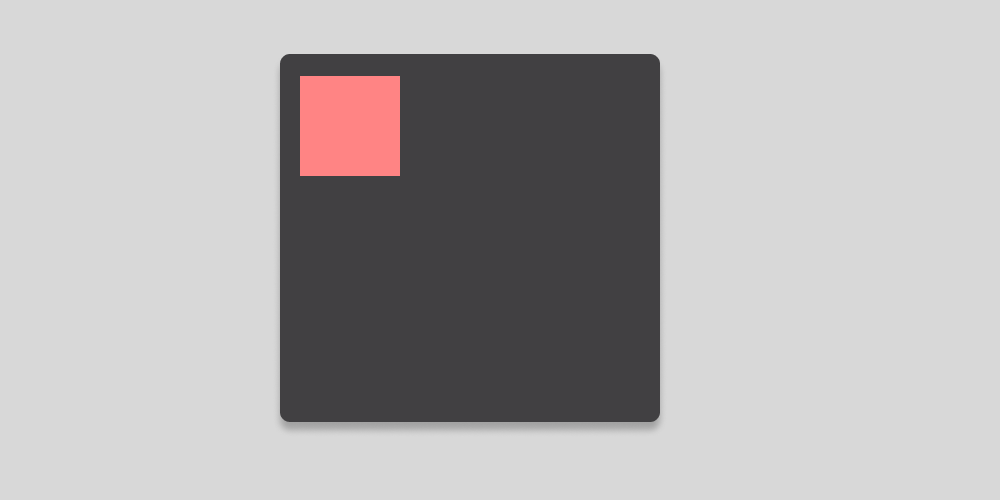
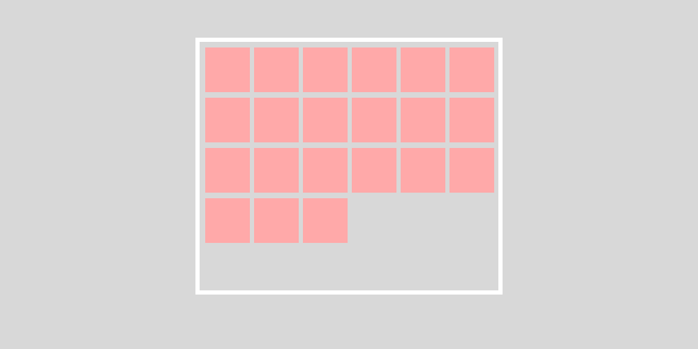
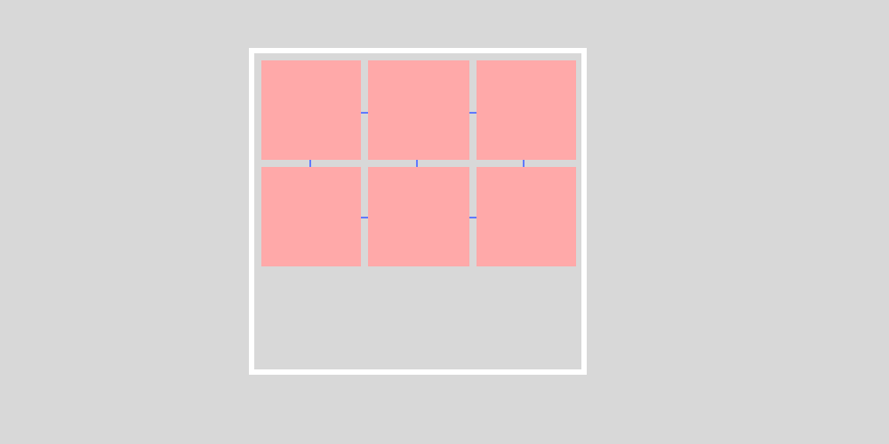

# Containerノードの基本

`Container`（コンテナ）ノードは、子ノードとしてコンテンツを持つことを前提としたノードです。
子ノードである**コンテンツを自動的にレイアウトすることを目的とした機能を持っています。**

継承元の`Container`ノード自体は`Control`ノードとほとんど機能は変わりませんので、単体で使用することはありません。
基本的には`Contianer`を継承している以下で紹介するノードの拡張のために準備された機能を持っています。

## コンテンツのレイアウト設定

基本的に`Container`の子ノードであるコンテンツはそれぞれの機能に応じて、自動的に大きさが決定され配置されます。
これは基本的に、コンテンツ自体のサイズやレイアウトを自由に決めることができないことを意味します。

ただし、コンテンツごとの`Container Sizing`で、コンテナ内でのサイズの設定を変更することができます。
これらは`Control`ノードのレイアウト設定なので、[Controlノードについて](/reference/GUI関連/Controlノードについて)を参照してください。

# 単一コンテナ

**単一コンテナ**はコンテンツを自動的にレイアウトしませんが、単一のコンテンツに対するレイアウトの設定を行うことができます。

## パネルを作る

`PanelContainer`は目に見えてわかりやすいコンテナです。
グラフィックが設定できるという以外は、基本の`Container`ノード（`Control`ノード）と同じ機能になります。

`panel`のプロパティを持っていますので、`テーマ`で`スタイル`を設定することができ、ウィンドウやヘッダー・フッターなどの下地に活用できます。

`テーマ`と`スタイル`については、[テーマとスタイルについて](/reference/GUI関連/テーマとスタイルについて)を参照してください。

## コンテンツのアスペクト比を固定する

`AspectContainer`は、自身のサイズが変わっても、コンテンツの縦横比を変えずにコンテンツを拡大・縮小して表示します。
その際、縦を基準とするか横を基準とするかを設定することができます。

## コンテンツのマージンを空ける

`MarginContainer`は`constants`プロパティで、上下左右のマージンをピクセル単位で設定することができるコンテナです。
コンテナ内のコンテンツに対し、それぞれのマージンを設定することができます。

## コンテンツをコンテナの縦横中央に配置する

`CenterContainer`は、コンテンツを親である`CenterContainer`の縦横中央に配置します。
親コンテナはコンテンツの大きさが最小の大きさになります。

# 整列コンテナ

**整列コンテナ**は複数のコンテンツを自動的にレイアウトするコンテナです。
例えば、ゲームのインベントリや、設定画面の項目を並べるような場合に活用できます。

## 縦並び・横並びにする

`VBoxContainer`または`HBoxContainer`は、複数のコンテンツを自動的に縦または横に並べて配置します。
コンテナのサイズよりも、コンテンツの合計サイズが大きくなる場合ははみ出して表示されます。

## 設定された個数分のコンテンツを順番に並べる

`GridContainer`は、`Columns`プロパティで設定された個数分のコンテンツを並べ、その個数を超えたら次の行に並べます。
もしも並んだコンテンツの横幅が、親のコンテナである`GridContainer`の横幅を超えた場合であっても、必ず並べるのが特徴です。

## コンテンツの大きさに応じて並べる

`FlowContainer`は、コンテンツの大きさに応じて自動的に並べ、`GridContainer`のように詰めて表示します。
親のコンテナである`FlowContainer`の幅に応じて、収まりきらないコンテンツは次の行または列にカラム落ちします。



### コンテンツ同士のマージンを空ける

上記で紹介した整列コンテナの`Theme Override`には`Constants`プロパティが設定されており、複数配置されたコンテンツ同士の上下左右のマージンを設定することができます。