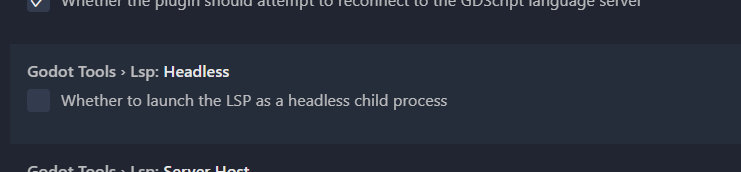
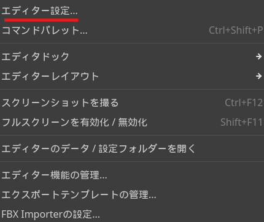
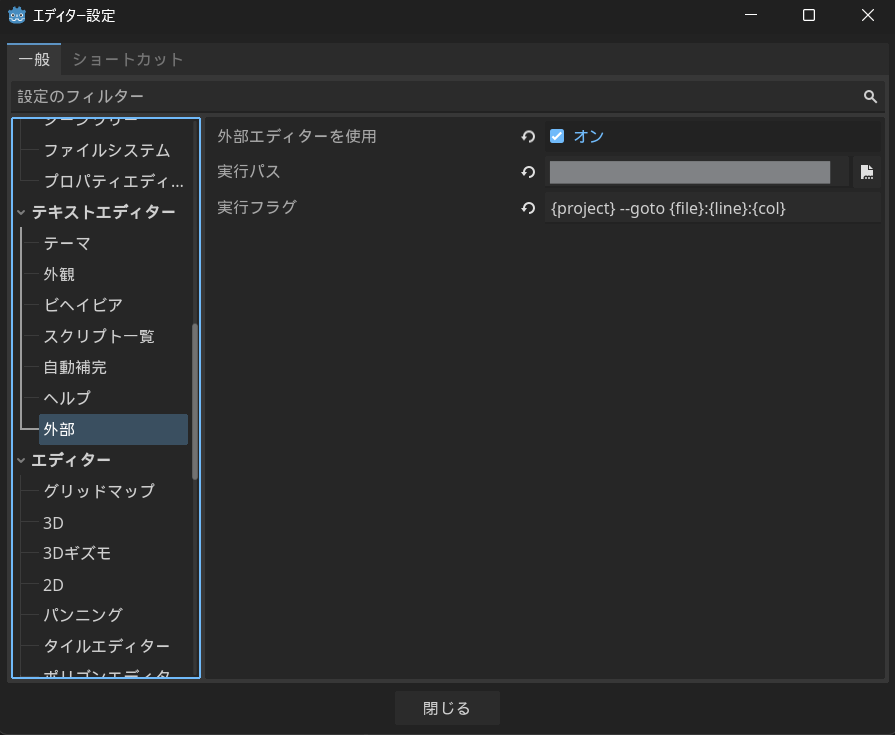

Godotでのゲーム開発において、Godotのエディタを開かなくても開発することは可能です。
アーティストとプログラマでの分業に役立つと思いますので、環境セットアップの一例として参考にどうぞ。

---

# VSCodeのインストール



ダウンロード・インストールは省きます。

# VSCodeプラグインのインストール

## Godot Toolsのインストール

#### Github


#### VSCode Market


### Godot Toolsの設定

#### エディターパスの設定

Godotエディタのexeファイルのパスを設定します。
`Godot 3.x`、`Godot 4.x`それぞれを設定することもできますが、そのプロジェクトでメインで使っているものだけでも問題ありません。

#### ヘッドレス設定

`Godot Tools > Lsp: Headless`にチェックを入れるとGodot Engineをヘッドレスモードで起動することができます。
ヘッドレスモードの場合は、Godot Engineのエディタを起動しなくても、Godot Engineでの開発を行うことができます。

チェックが入っていない場合、そのプロジェクトが開かれた起動中のGodotエディタと通信しようとします。
もしGodotが起動していない場合は、そのプロジェクトを開きGodotエディタを起動します。

### Godot Engineの設定

Godot Engineのエディタ設定を開きます。
ツールメニューの`エディター > エディター設定`です。

エディタ設定の中から`テキストエディター > 外部`の項目を選択します。

| プロパティ | 値 |
| -- | -- |
| 外部エディターを使用 | `true` |
| 実行パス | `VSCode実行ファイルのパス` |
| 実行フラグ | `{project} --goto {file}:{line}:{col}` |

---

以上でGodot EngineとVSCodeの設定が完了しました。

## 便利なGodot開発向けVSCodeプラグイン

#### GDScript Theme

いろんなものがVSCode自体もシンタックスハイライトもGodotカラーになるのでわかりやすい。



#### gdshader lsp

GDShader用のプラグイン
シンタックスハイライト、コード補完など



#### C# Tools for Godot

Godot C#用のプラグイン



#### godot gdextention C++ snippets

GDExtension用のプラグイン

